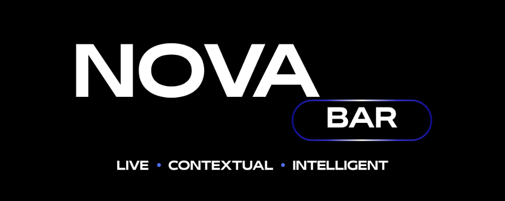
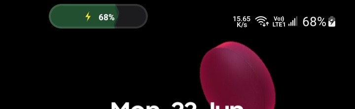
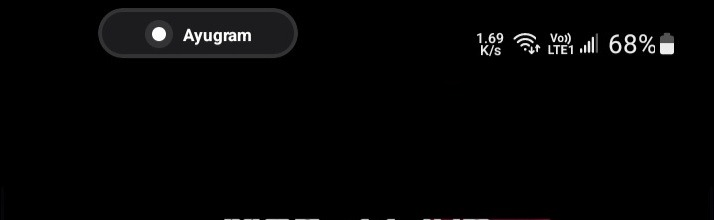
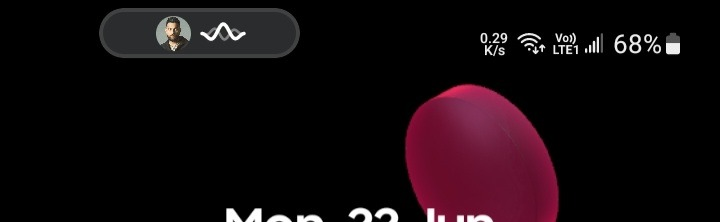
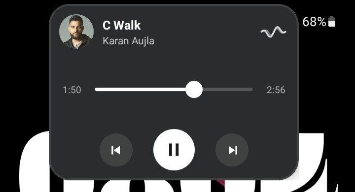
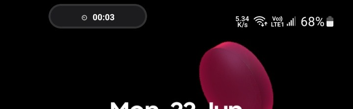

# Nova Bar

Modern live activities for Android.

Nova Bar brings contextual, glanceable information directly to the status bar area through a lightweight overlay system. Inspired by modern mobile UI experiences, it provides quick access to media playback, timers, navigation, notifications, calls, charging status, and more without requiring root access.

Designed for older Android versions that never received native live activities, Nova Bar focuses on being fast, customizable, and system-like.

---

## Features

### 🎵 Media Playback

* Real-time media session detection
* Album artwork support
* Play / Pause controls
* Previous / Next controls
* Playback progress support
* Minimized and Compact media views
* Automatic app detection

### ⏱ Timers & Stopwatch

* Active timer detection
* Active stopwatch detection
* Live countdown updates
* Clean HH:MM:SS formatting
* Minimized and Compact views

### 🧭 Navigation

* Active navigation session detection
* Route information support
* Compact navigation activity display

### 🔔 Notifications

* Displays app names instead of package names
* Clean notification presentation
* Compact activity display
* Quick glance information

### 📞 Calls

* Active call detection
* Compact call activity
* End call support
* Real-time call state updates

### ⚡ Charging Activity

* Live battery percentage display
* Dynamic charging activity
* Battery reservoir animation
* Charging status updates

---

## Activity System

Nova Bar automatically adapts based on what you're currently doing.

Supported activities include:

* Media Playback
* Timers
* Stopwatch
* Navigation
* Notifications
* Charging
* Calls

Every activity includes:

### Minimized View

Shows only the most important information.

Examples:

* Album artwork + visualizer
* Timer icon + remaining time
* Navigation indicator
* Battery percentage
* Notification icon

### Compact View

Displays additional information and controls while maintaining a lightweight footprint.

Examples:

* Media controls
* Timer information
* Navigation details
* Notification details
* Call controls

---

## Overlay Engine

Nova Bar supports two overlay engines.

### Application Overlay

Uses Android's standard overlay system.

### Accessibility Overlay

Uses Android Accessibility Services to render above the status bar area without root access.

Benefits:

* Better integration with System UI
* Status bar level rendering
* Improved immersion
* More native appearance

---

## Customization

### Position

* Left Alignment
* Center Alignment
* Right Alignment

### Alignment-Aware Expansion

Nova Bar intelligently expands according to its position.

#### Left Alignment

* Left edge remains fixed
* Expands toward the right

#### Center Alignment

* Expands symmetrically

#### Right Alignment

* Right edge remains fixed
* Expands toward the left

This ensures the activity panel remains visible and avoids rendering outside the screen boundaries.

### Appearance

* Transparency control
* Width scaling
* Height adjustments
* Vertical offset
* Horizontal offset
* 12-hour clock support
* Always-On Bar option
* Show on Lockscreen toggle

---

## Permissions

Nova Bar requires the following permissions:

### Accessibility Service

Required for:

* Accessibility Overlay engine
* Enhanced system integration
* Activity detection
* Overlay rendering

### Notification Access

Required for:

* Media playback detection
* Notifications
* Timers
* Stopwatch activities
* Navigation activity detection

### Display Over Other Apps

Required when using the Application Overlay engine.

### Phone / Call Control Permission

Required for:

* Call activity detection
* Call state monitoring
* End call functionality

Nova Bar only uses call-related permissions to provide call activities and call controls inside the bar.

No call data is collected, stored, or transmitted.

Nova Bar includes a built-in permissions dashboard with real-time status indicators for all required permissions.

---

## Design Goals

Nova Bar was built around four principles:

### Lightweight

The overlay remains compact and unobtrusive.

### System-Like

Animations, interactions, and layouts are designed to feel like a native Android component.

### Customizable

Users control positioning, alignment, transparency, sizing, and behavior.

### Practical

Information should be available at a glance without interrupting the current task.

---

## Privacy

Nova Bar does not:

* Collect personal data
* Upload information to external servers
* Include analytics
* Include tracking

All processing happens locally on your device.

---

## Compatibility

### Minimum Android Version

Android 12+

### Tested Devices

* Samsung Galaxy A21s (running on One ui 4)(android 12)
* Redmi Pad (running on HyperOS 2 port)(android 15)
* Redmi 14c 5G (running o HyperOS 3)(android 16)

Compatibility may vary depending on manufacturer restrictions and battery optimization policies.

---

## Installation

1. Download the latest APK from Releases.
2. Install Nova Bar.
3. Grant required permissions.
4. Enable your preferred overlay engine.
5. Customize the layout.
6. Enjoy modern live activities on Android.

---

## Known Limitations

* Timer synchronization may occasionally differ from the source timer by a fraction of a second depending on notification update timing.
* Some manufacturers may aggressively restrict background services.

---

## Roadmap

### v1.1

* Additional activity integrations
* UI refinements
* Animation improvements
* Performance optimizations
* Synchronization improvements

---

## Inspiration

Nova Bar was inspired by modern live activity systems and Samsung's Now Bar experience while being designed specifically for broader Android compatibility.

---

## Previews

### Charging Pill

### Notification Pill

### Music Pill

### Expanded Music Panel

### Stopwatch

---
## License

Nova Bar is licensed under the MIT License.

You are free to use, modify, distribute, and fork this project in accordance with the terms of the license.

See the [LICENSE](LICENSE) file for full details.

