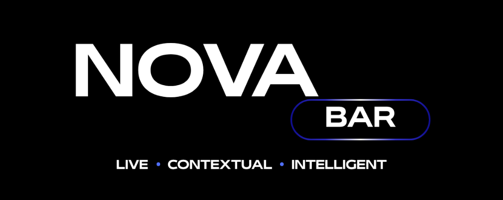
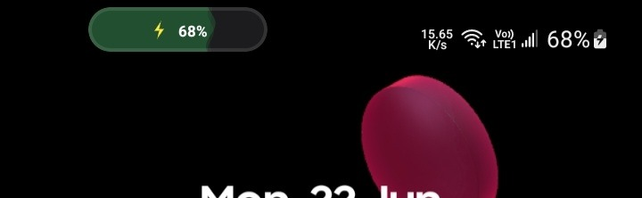
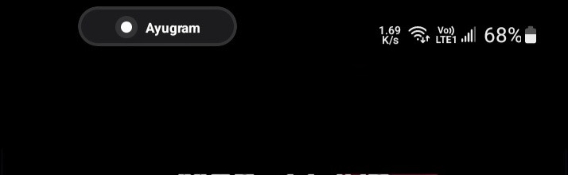
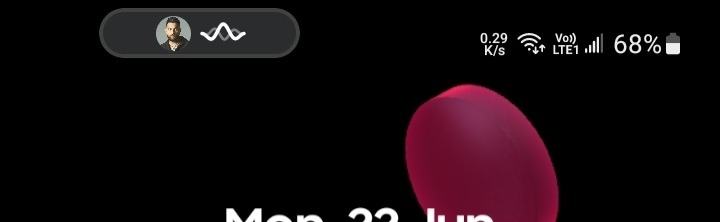
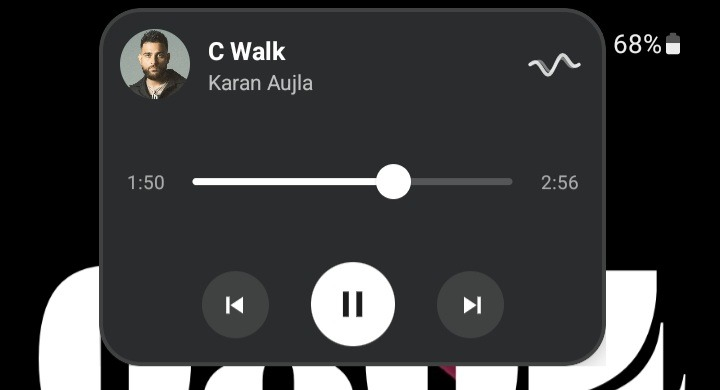
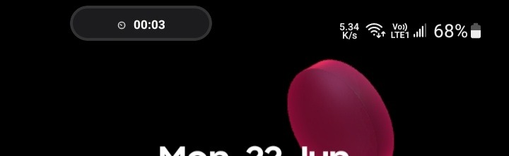
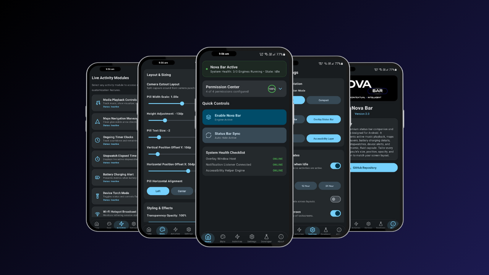

# Nova Bar

Modern live activities for Android.

Nova Bar brings contextual, glanceable information directly to the status bar area through a lightweight overlay system. Inspired by modern mobile UI experiences, it provides quick access to media playback, timers, navigation, notifications, calls, charging status, and more without requiring root access.

Designed for older Android versions that never received native live activities, Nova Bar focuses on being fast, customizable, and system-like.

---

## Features

### Media Playback

### Timers & Stopwatch

### Navigation

### Notifications

### Calls

### Charging Activity

### Hotspot

### Voice Recorder

### NovaGuy

---

## NovaGuy

### Your own companion

* Appears throughout the day.
* Greets you with contextual messages.
* Reacts to your music.
* Warns you when your battery is low.
* Silently watches over your lock screen

## Activity System

Nova Bar automatically adapts based on what you're currently doing.

Supported activities include:

* Media Playback
* Timers
* Stopwatch
* Navigation
* Notifications
* Charging
* Calls
* Hotspot
* Voice Recorder

Every activity includes:

### Minimized View

Shows only the most important information.

### Compact View

Displays additional information and controls while maintaining a lightweight footprint.

## Overlay Engine

Nova Bar supports two overlay engines.

### Application Overlay

Uses Android's standard overlay system.

### Accessibility Overlay

Uses Android Accessibility Services to render above the status bar area without root access.

Benefits:

* Better integration with System UI
* Status bar level rendering
* Improved immersion
* More native appearance

## Customization

### Position

* Left Alignment
* Center Alignment
* Right Alignment

### Appearance

* Transparency control
* Width scaling
* Height adjustments
* Vertical offset
* Horizontal offset
* 12-hour clock support
* Always-On Bar option
* Show on Lockscreen toggle

---

## Permissions

Nova Bar requires the following permissions:

### Accessibility Service

### Notification Access

### Display Over Other Apps

Required when using the Application Overlay engine.

### Phone / Call Control Permission

Nova Bar only uses call-related permissions to provide call activities and call controls inside the bar.

No call data is collected, stored, or transmitted.

Nova Bar includes a built-in permissions dashboard with real-time status indicators for all required permissions.

---

## Design Goals

Nova Bar was built around four principles:

### Lightweight

The overlay remains compact and unobtrusive.

### System-Like

Animations, interactions, and layouts are designed to feel like a native Android component.

### Customizable

Users control positioning, alignment, transparency, sizing, and behavior.

### Practical

Information should be available at a glance without interrupting the current task.

---

## Privacy

Nova Bar does not:

* Collect personal data
* Upload information to external servers
* Include analytics
* Include tracking

All processing happens locally on your device.

---

## Compatibility

### Minimum Android Version

Android 12+

### Tested Devices

* Samsung Galaxy A21s (running on One ui 4)(android 12)
* Redmi Pad (running on HyperOS 2 port)(android 15)
* Redmi 14c 5G (running on HyperOS 3)(android 16)

Compatibility may vary depending on manufacturer restrictions and battery optimization policies.

---

## Installation

1. Download the latest APK from Releases.
2. Install Nova Bar.
3. Grant required permissions.
4. Enable your preferred overlay engine.
5. Customize the layout.
6. Enjoy modern live activities on Android.

---

## Known Limitations

* Timer synchronization may occasionally differ from the source timer by a fraction of a second depending on notification update timing.
* Some manufacturers may aggressively restrict background services.
* Voice recorder activity controls are not working on samsung devices because samsung uses it's proprietary RemoteViews that are not exposed through public Android APIs.

---

## Inspiration

Nova Bar was inspired by modern live activity systems and Samsung's Now Bar experience while being designed specifically for broader Android compatibility.

---

## Previews

### Charging Pill

### Notification Pill

### Music Pill

### Expanded Music Panel

### Stopwatch Pill

### App UI

---
## License

Nova Bar is licensed under the MIT License.

You are free to use, modify, distribute, and fork this project in accordance with the terms of the license.

See the [LICENSE](LICENSE) file for full details.

